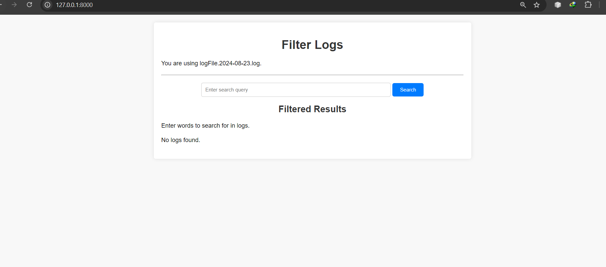

To continue with the installation steps for the `LogFilter` Django application on the `eduhapi` GitHub profile, follow these instructions:



### Step-by-Step Guide to Install `LogFilter`

#### 1. Clone the Repository

To start using `LogFilter`, you'll first need to clone the repository from GitHub.

**Command:**
```bash
git clone https://github.com/eduhapi/LogFilter.git
```

This command will copy the `LogFilter` repository from GitHub to your local machine.

#### 2. Navigate to the Cloned Repository

After cloning, navigate into the `LogFilter` directory to access the project files.

```bash
cd LogFilter
```

#### 3. Create a Virtual Environment

It's a good practice to use a virtual environment for your Python projects to manage dependencies and avoid conflicts.

**Create a virtual environment:**

- **Windows:**
  ```bash
  python -m venv venv
  ```

- **macOS/Linux:**
  ```bash
  python3 -m venv venv
  ```

**Activate the virtual environment:**

- **Windows:**
  ```bash
  venv\Scripts\activate
  ```

- **macOS/Linux:**
  ```bash
  source venv/bin/activate
  ```

#### 4. Install Dependencies

Once the virtual environment is activated, install the necessary dependencies for `LogFilter` from the `requirements.txt` file.

**Command:**
```bash
pip install -r requirements.txt
```

This will install all the packages needed to run the `LogFilter` application.

#### 5. Apply Migrations

Before running the Django application, apply the migrations to set up the database.

**Command:**
```bash
python manage.py migrate
```

This command will set up the database tables required for the `LogFilter` application.

#### 6. Run the Development Server

Start the Django development server to run the application locally.

**Command:**
```bash
python manage.py runserver
```

Open a web browser and go to `http://127.0.0.1:8000/` to view the application.

#### 7. Access the Application

After the server is running, you can access `LogFilter` through your web browser to start filtering and managing logs.

